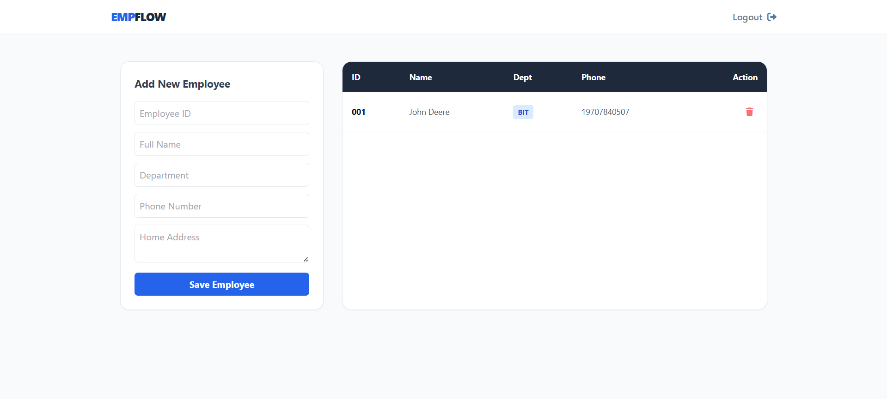

# 🚀 EmpFlow: Employee Management System
<p align="center">
  
  
  
  
  
</p>

---

## 📝 Project Overview
This project focuses on building a clean and functional system for managing employee records with a responsive UI and efficient backend logic. It demonstrates core concepts of CRUD operations, authentication, and data persistence.


---

## ✨ Features
- 🔐 Secure admin authentication (login & signup)
- 📊 Dynamic dashboard with real-time updates (Fetch API)
- 🧾 Full CRUD operations for employee management
- 💾 Persistent data storage using json file 
- 🎨 Modern UI using Tailwind CSS (Glassmorphism design)
- 📂 Employees data will be saved in `'employees.txt`
- 🔐 Login/Signup information will be saved in `users.json`

---

## 🛠️ Tech Stack

| Category | Technology |
|----------|-----------|
| Backend | Java 25, Javalin |
| Build Tool | Maven |
| Frontend | HTML5, JavaScript (ES6), Tailwind CSS |
| Storage | Flat-file (employees.txt) |

---

## 📚 What I Learned

- Implementing CRUD operations in a real-world system  
- Handling data persistence without a database  
- Building REST-like backend using Javalin  
- Creating responsive UI with Tailwind CSS  
- Structuring a full-stack application
- Employee data will be saved in employees.txt
- Login/Signup information will be saved in Users.txt 

---

## 🚀 How to Run

### 1. Prerequisites
-  Ensure **JDK 25** is installed and `JAVA_HOME` is configured.
- Apache Maven installed  

### 2. Installation
```bash
git clone https://github.com/NexVerix/EmpFlow-Java-System
cd EmpFlow
```

### 3. Clean previous builds and compile classes
```
mvn clean compile
```
### 4. Execute using double-quoted runtime property parameters
```
mvn exec:java "-Dexec.mainClass=App"
```
--- 

## 🖼️ Interface Preview
<p align="center">
  
  
  
  
</p>

---

## 👨‍💻 Author

**Md Aziz Rain**  
Built under **NexVerix** — focusing on practical and real-world development. <br>
GitHub: https://github.com/NexVerix   
